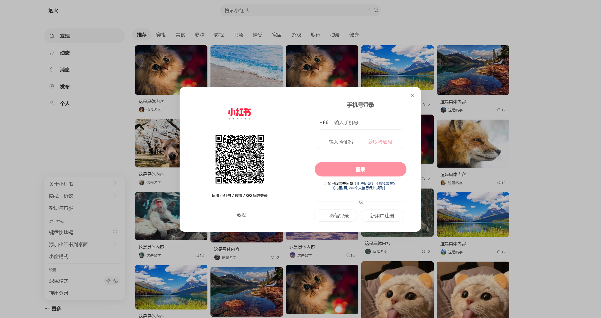
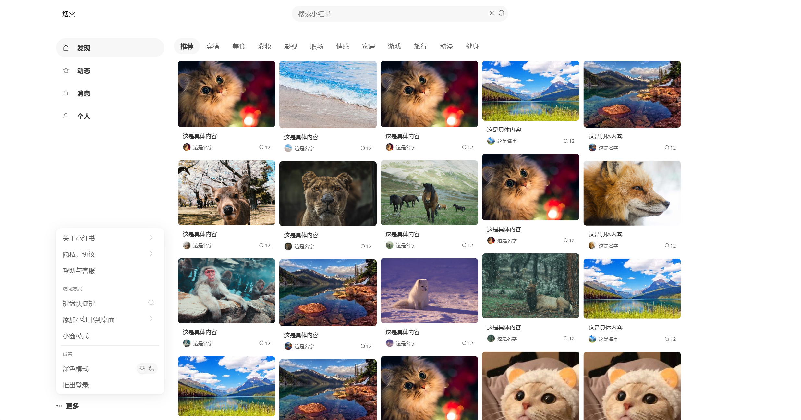
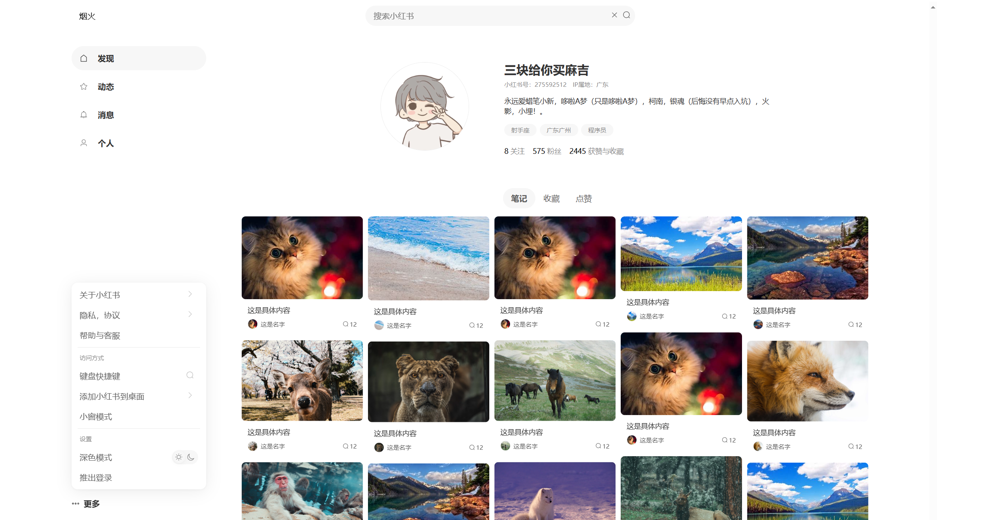
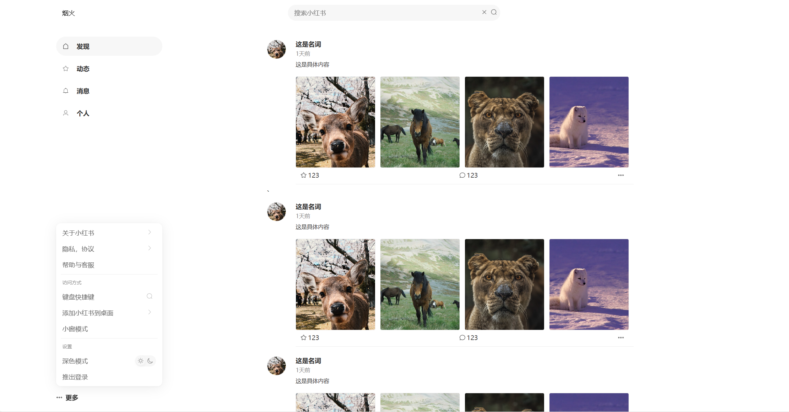
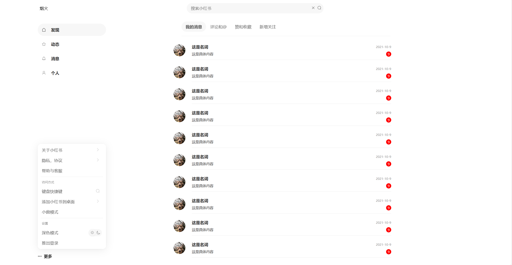
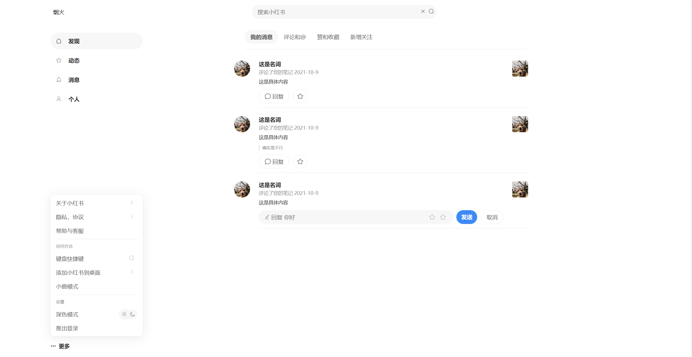
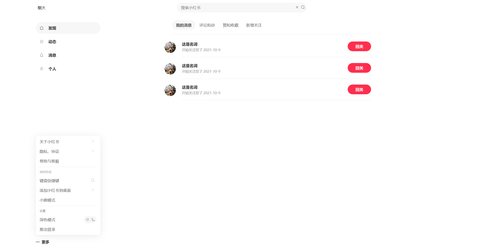

# 医路相伴 - 医疗互助交流平台

#### 项目介绍
一个基于 Vue3 的医疗互助交流平台前端项目。项目借鉴了小红书的用户友好界面设计理念，专注于医疗健康领域的信息分享和交流。

#### 技术栈
- 前端框架：Vue3
- UI 设计：参考小红书设计风格
- 后端整合：完整的前后端分离架构

#### 核心功能
- 医疗经验分享
- 康复日记记录
- 病友圈子交流
- 专业医生问答
- 实时消息通知
- 个性化推荐

#### 页面展示

|  |  |
| ----------------------------------------- | ----------------------------------------- |
|  |  |
|  |  |
|  |  |

#### 开发说明
本项目基于 Vue3 开发，您只需要:
1. 了解基础的 Vue3 开发知识
2. 编写对应的后端接口
即可完成完整项目的开发部署。

#### 仓库地址
https://github.com/wangxinleo/rednote-like.git

#### 开发指南

##### 环境要求
- Node.js >= 16.0.0
- npm >= 7.0.0
- Git

##### 本地开发
1. 克隆项目
```bash
git clone https://github.com/wangxinleo/rednote-like.git
cd rednote-like
```

2. 安装依赖
```bash
npm install
```

3. 启动开发服务器
```bash
npm run dev
```

4. 打开浏览器访问 http://localhost:3000

##### 项目构建
```bash
npm run build
```

##### 目录结构
```
rednote-like/
├── src/                    # 源代码目录
│   ├── api/               # API 接口
│   ├── assets/            # 静态资源
│   ├── components/        # 公共组件
│   ├── pages/             # 页面组件
│   ├── router/            # 路由配置
│   ├── store/             # 状态管理
│   └── utils/             # 工具函数
├── public/                # 公共资源
├── index.html             # HTML 模板
├── package.json           # 项目配置
└── vite.config.ts         # Vite 配置
```

##### 代码规范
- 遵循 Vue3 组合式 API 规范
- 使用 TypeScript 进行类型检查
- 采用 ESLint 进行代码格式化

##### 部署说明
1. 构建项目生成 dist 目录
2. 将 dist 目录下的文件部署到 Web 服务器
3. 配置 nginx 或其他 Web 服务器的反向代理

##### 注意事项
- 开发前请确保已配置好后端 API 地址
- 遵循组件化开发原则
- 注意代码提交时的 git commit 规范
- 建议使用 Visual Studio Code 进行开发

